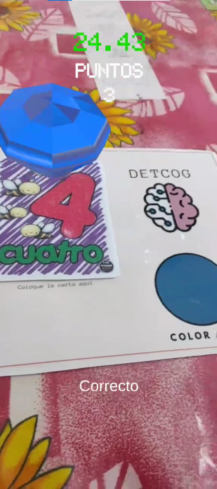

# App DetCog
 App con una actividad de categorización de color para la prevención de deterioro cognitivo en adultos mayores.

## Documentación
- [Instalación y Ejecución](./Documentacion/ManualUsuario_DetCog.pdf) 
- [Manual Técnico](./Documentacion/ManualTecnico_DetCog.pdf)

### Alcance Global
Tener una aplicación de realidad aumentada que contenga diversos mini juegos o actividades enfocadas a las personas que sufran de algún deterioro cognitivo y así poder estimular su cerebro para evitar o prevenir el avance del mismo.
### Alcance Local
Tener una aplicación de realidad aumentada que contenga 1 o 2 actividades enfocadas a las personas mayores que sufran de algún deterioro cognitivo, para así estimular su cerebro con estas actividades además de acercarlos a este mundo tecnológico que normalmente desconocen y al adentrarse en el su cerebro se vea más estimulado al experimentarlo.

### Justificación
El aumento del envejecimiento a nivel mundial no tiene precedentes. Constituye una transformación demográfica de nuestra sociedad, caracterizada por un incremento en la proporción de personas de edades avanzadas respecto a la de jóvenes.

En 2019, las personas mayores de 65 años representaron el 19.4% de la población total de España. Esta franja de edad ha crecido significativamente. Casi 10 puntos desde los años 70.

**La realidad virtual puede ser útil como una versión de alta tecnología de la terapia de reminiscencia. A través de ella, se alienta a las personas con algún trastorno neurocognitivo mayor a la observación y discusión de actividades, eventos y experiencias pasadas.**

Generalmente se sirve de la ayuda de recuerdos tangibles como fotografías u objetos. También de alternativas como música o vídeos que les resulten familiares y evoquen recuerdos. Lo que se pretende es estimular su estado de ánimo.

**La tecnología inmersiva está teniendo un impacto positivo en las personas mayores. Sus diferentes usos pueden tener un gran potencial durante esta etapa de la vida.**

Una reciente revisión de la literatura señala que **la realidad virtual puede ser una estrategia para prevenir el desarrollo de problemas cognitivos. Podría aplicarse como herramienta diagnóstica de detección de deterioro leve o demencia, ser efectiva como tratamiento y mejorar el funcionamiento cognitivo.**

Sobre esto último, si reparamos en el **tiempo adecuado de uso, una experiencia práctica en una residencia de Estados Unidos incidió en que la realidad virtual para personas mayores debe considerar un ritmo más lento.**

**Además, es recomendable utilizarla en pequeñas “dosis”. Por ejemplo, de 15 a 20 minutos y unas tres veces a la semana.**

La Asociación Española contra el Cáncer (AECC) también señala que **la realidad virtual ha podido disminuir un 84% la sensación de dolor y un 26% la ansiedad antes del tratamiento.**

**Además, el 88% de las personas han manifestado tener la sensación de que el tiempo de tratamiento ha pasado más rápido. También que les ha ayudado a sobrellevar la quimioterapia.**

## Funcionamiento
<video width="320" height="240" controls>
  <source src="/Documentacion/Varios/VideoDemoAppDetCog.mp4" type="video/mp4">
</video>

